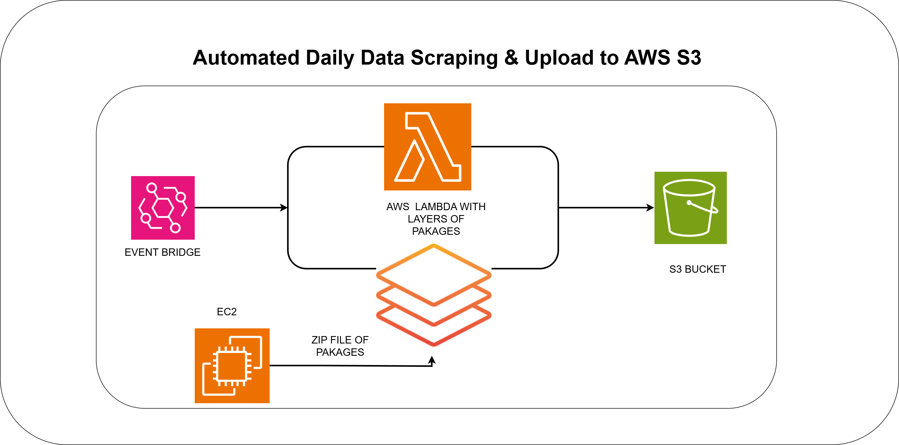

# MUFAP Web Scraper - AWS Lambda Project

## Project Overview
This project is an automated web scraping solution that extracts daily mutual fund industry statistics from the MUFAP (Mutual Funds Association of Pakistan) website and stores the data in AWS S3. The solution is built using AWS Lambda with Selenium for web scraping capabilities.

## Architecture



The system consists of the following components:

1. **AWS Lambda Function**: Serverless compute service that runs the scraping logic
2. **Selenium Layer**: Custom Lambda layer containing Selenium and ChromeDriver for web scraping
3. **EventBridge Scheduler**: Triggers the Lambda function on a scheduled basis
4. **S3 Bucket**: Stores the scraped data as JSON files with timestamps
5. **Source Website**: MUFAP website (https://www.mufap.com.pk)

## Features

- ✅ Automated daily scraping of MUFAP industry statistics
- ✅ Serverless architecture using AWS Lambda
- ✅ Data stored in structured JSON format
- ✅ Timestamped data files for historical tracking
- ✅ Scheduled execution via EventBridge
- ✅ Error handling and logging

## Prerequisites

- AWS Account
- AWS CLI configured
- Python 3.x
- Basic knowledge of AWS Lambda and S3

## Project Structure

```
mufap/
├── scraper.py              # Main Lambda function code
├── selenium-layer.zip      # Selenium + ChromeDriver Lambda layer
├── LAMBDA.drawio.png       # Architecture diagram
├── Project Report.docx     # Detailed project documentation
├── kp-mafup-us.pem        # AWS key pair (keep secure)
└── README.md              # This file
```

## Configuration

Before deploying, update the following configuration in `scraper.py`:

```python
BUCKET_NAME = "your-s3-bucket-name"    # Your S3 bucket name
REGION_NAME = "us-east-1"              # AWS region
URL = "https://www.mufap.com.pk/Industry/IndustryStatDaily?tab=3"
FOLDER_NAME = "mufap-data"             # S3 folder for storing data
```

## Setup Instructions

### 1. Create S3 Bucket
```bash
aws s3 mb s3://your-bucket-name --region us-east-1
```

### 2. Create Lambda Layer
Upload the `selenium-layer.zip` as a Lambda layer:
```bash
aws lambda publish-layer-version \
    --layer-name selenium-layer \
    --zip-file fileb://selenium-layer.zip \
    --compatible-runtimes python3.9
```

### 3. Create Lambda Function
```bash
aws lambda create-function \
    --function-name mufap-scraper \
    --runtime python3.9 \
    --role arn:aws:iam::YOUR_ACCOUNT_ID:role/lambda-execution-role \
    --handler scraper.lambda_handler \
    --zip-file fileb://scraper.zip \
    --timeout 300 \
    --memory-size 1024
```

### 4. Attach Lambda Layer
```bash
aws lambda update-function-configuration \
    --function-name mufap-scraper \
    --layers arn:aws:lambda:REGION:ACCOUNT_ID:layer:selenium-layer:VERSION
```

### 5. Configure EventBridge Rule
Create a scheduled rule to trigger the Lambda function daily:
```bash
aws events put-rule \
    --name mufap-daily-scraper \
    --schedule-expression "cron(0 10 * * ? *)"
```

## Lambda Function Code

The `scraper.py` file contains the main logic:

- **Web Scraping**: Uses Selenium to navigate and extract data from MUFAP website
- **Data Processing**: Parses HTML table data and structures it as JSON
- **S3 Storage**: Uploads the scraped data to S3 with timestamp
- **Error Handling**: Comprehensive error handling with logging

## Data Format

The scraped data is stored in JSON format:

```json
{
    "scraped_at": "2024-01-15 10:30:45",
    "data": [
        ["Column1", "Column2", "Column3"],
        ["Value1", "Value2", "Value3"],
        ...
    ]
}
```

## IAM Permissions Required

The Lambda execution role needs the following permissions:

```json
{
    "Version": "2012-10-17",
    "Statement": [
        {
            "Effect": "Allow",
            "Action": [
                "s3:PutObject",
                "s3:GetObject"
            ],
            "Resource": "arn:aws:s3:::your-bucket-name/*"
        },
        {
            "Effect": "Allow",
            "Action": [
                "logs:CreateLogGroup",
                "logs:CreateLogStream",
                "logs:PutLogEvents"
            ],
            "Resource": "arn:aws:logs:*:*:*"
        }
    ]
}
```

## Monitoring and Logs

- View Lambda execution logs in CloudWatch Logs
- Monitor function metrics in Lambda console
- Check S3 bucket for successfully scraped data files

## Troubleshooting

### Common Issues:

1. **Timeout Error**: Increase Lambda timeout (max 15 minutes)
2. **Memory Error**: Increase Lambda memory allocation
3. **Selenium Error**: Ensure selenium-layer is properly attached
4. **S3 Permission Error**: Verify IAM role has S3 write permissions

## Cost Estimation

- Lambda: ~$0.20 per 1 million requests
- S3: ~$0.023 per GB stored
- Data Transfer: Minimal for this use case

**Estimated Monthly Cost**: < $1 for daily scraping

## Future Enhancements

- [ ] Add data validation and cleaning
- [ ] Implement SNS notifications for failures
- [ ] Add DynamoDB for metadata storage
- [ ] Create API Gateway endpoint for on-demand scraping
- [ ] Add data analytics dashboard

## Security Notes

⚠️ **Important**:
- Never commit AWS credentials or `.pem` files to version control
- Use AWS Secrets Manager for sensitive configuration
- Implement least privilege IAM policies
- Enable S3 bucket encryption

## License

This project is for educational purposes.

## Contact

For questions or issues, please refer to the project documentation.

---

**Last Updated**: 2024
**Version**: 1.0
